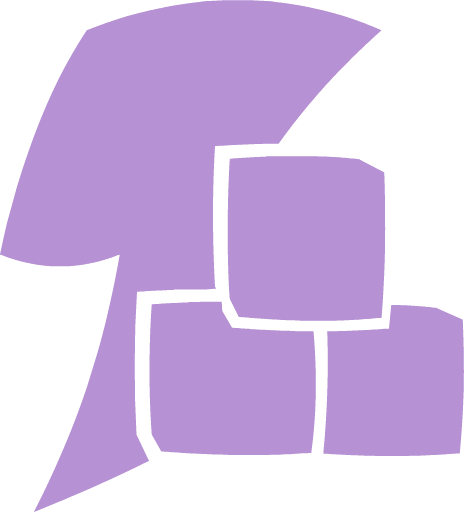

<!-- markdownlint-disable MD041 MD033 -->

# Junction

**Junction** is a Luau package that manages functions between events under a single shared connection.

 

## Why use Junction?

Binding multiple functions to the same event across many scripts leads to unnecessary duplicate connections.  
Junction puts them into a single pool, reducing overhead and improving organization.

 

## Documentation

`Junction.GetPool(Event) → Pool`

Returns a connection pool for the given event. If no pool exists, one will be created automatically.

- **Event** `RBXScriptSignal` - The event associated with the connection pool.

 

`Pool:Mount(Name, Function)`

Binds a function to the pool.

- **Name** `string` - Identifier used for unmounting.
- **Function** `(...any) -> ()` - Function invoked when the event fires.

 

`Pool:Unmount(Name)`

Unbinds a function from the pool. If no functions remain, the connection is temporarily disconnected until one is added again.

- **Name** `string` - Identifier of the function to unbind.

 

`Pool:BulkUnmount(Predicate)`

Unbinds multiple functions based on a predicate.

- **Predicate** `(Name: string) -> boolean` - Return `true` to unmount the function.

 

`Pool:Destroy()`

Disconnects the pool's connection.
